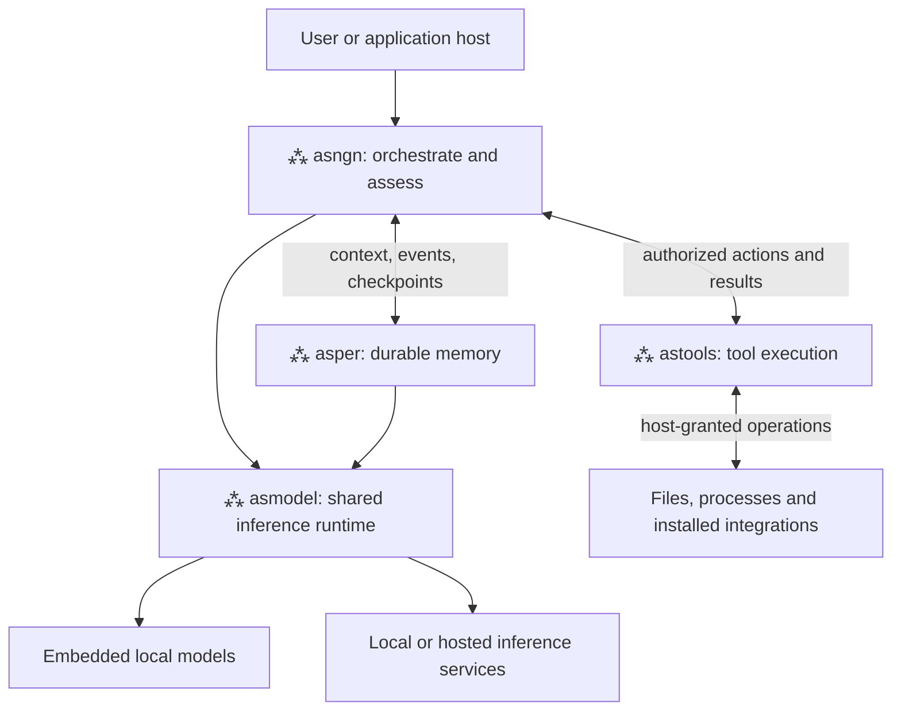

# ⁂ asterism architecture: decisions and system value

⁂ asterism is a modular agent harness for turning language models into instruments
that can create and carry out real-world workflows and automations. Its value is
in the complete execution system: models propose decisions, tools perform
authorized actions, memory preserves context and evidence, and the orchestrator
controls progress and reports what actually happened.

The design is **SLM-friendly, not SLM-only**, and **local-first, not local-only**.
Small language models benefit especially from narrow tasks and focused context;
larger models benefit from the same execution, memory and accountability
contracts. Local deployment is a primary design target. Remote and mixed model
pools are also supported architectural choices. Any LLM from any provider can
be integrated through an appropriate adapter that meets the requirements of its
assigned role. This does not imply automatic support for every provider API.

“Evolving LLMs” here means expanding what the model-plus-harness system can do.
It does not mean autonomous weight training or a demonstrated increase in the
underlying model's intelligence. Coding is one implemented specialization of a
broader workflow architecture.

This is the central rationale for **all four projects**. Component `SPECS.md`
files describe their internal architecture; the linked contract documents and
public headers define implementation details. Benefits below explain why the
choices matter, rather than asserting unmeasured performance gains.

## Naming convention

Use **⁂ asterism**, **⁂ asngn**, **⁂ asper**, **⁂ astools** and **⁂ asmodel**
for product names in documentation prose, headings and diagrams. Always place
U+2042 (`⁂`) before the lowercase name, separated by one space.

The symbol belongs in documentation and prose comments in source code. Runtime
strings, UI labels, identifiers and package/protocol metadata use lowercase names
without it. Literal technical spellings inside comments remain unchanged.
Executable names, API identifiers, imports, paths, configuration values and code
examples retain their literal technical spelling, such as `asngn --help`,
`asmodel_manager`, `@asterism/sdk` and `asterism-asper`.

## 1. Four components, one execution system

| Component | Owns | Value to the complete system | Technical reference |
|---|---|---|---|
| **⁂ asngn** | Turn orchestration, task state, routing, approvals, progress guards and outcome policy | Converts a request into controlled steps and distinguishes an answer from completed work | [Engine specification](SPECS.md), [C API](../include/asngn.h) |
| **⁂ asper** | Exact source events, semantic memory, checkpoints and large objects | Gives work continuity beyond a context window while preserving inspectable evidence | [Memory specification](https://github.com/gslf/asterism-asper/blob/main/docs/SPECS.md) |
| **⁂ astools** | Tool packages, discovery, schemas, permissions and supervised execution | Gives model intent a typed, authorized route to real effects and structured observations | [Tool specification](https://github.com/gslf/asterism-astools/blob/main/docs/SPECS.md) |
| **⁂ asmodel** | Provider adapters, model instances, inference contracts and resource accounting | Makes inference reusable across components without hiding provider differences | [Runtime specification](https://github.com/gslf/asterism-asmodel/blob/main/docs/SPECS.md) |

### Decision 1 — Give each subsystem a single owner

The engine delegates memory to ⁂ asper, inference to ⁂ asmodel, and tool execution
to ⁂ astools. Engine action journals, acceptance state and consumption logs retain
their own operational authority; they are not competing conversation stores.
This prevents duplicated histories, independent model pools and inconsistent
tool policy. The tradeoff is explicit cross-component contracts and coordinated
versions. That cost makes failures easier to locate and components reusable.

### Decision 2 — Build reusable native libraries with external host surfaces

C APIs expose the components independently. MCP surfaces expose memory, tools
and engine sessions; the engine also has a terminal client, host SDKs and a
limited ACP editor host. The orchestration policy belongs to the engine rather
than to each UI. This lets an application embed the harness or supervise it as a
process. Native integration requires ABI discipline, ownership rules and careful
failure boundaries. See [host SDKs](../sdk/README.md) and [ACP scope](acp.md).

### Decision 3 — Optimize for local resources without fixing model size or vendor

Model roles, inference adapters and execution policy are distinct. Small local
models are useful economical choices, but no architectural boundary makes a
large model or a hosted service a different harness. Local execution gives an
operator control over model placement and data handling; remote inference can
provide capabilities or capacity unavailable on the local machine. The tradeoff
is deployment-specific latency, cost and data flow. A local memory store does
not keep prompts local when remote inference is selected.

## 2. ⁂ asngn: turning requests into accountable work

### Decision 4 — Decompose execution into narrow model passes

Routing, next-action selection and response drafting have separate contracts.
The decision loop asks for a bounded action, observes its result and supplies the
next focused problem. Deterministic code carries workflow state between passes.
This reduces the number of responsibilities a small model must solve at once
and gives larger models the same inspectable control flow. Extra passes have
latency and prompt costs; routing and reuse must justify them through outcomes.
See [turn pipeline and decision protocol](SPECS.md#3-the-turn-pipeline).

### Decision 5 — Separate structured intent from execution authority

Schema/grammar-constrained actions reduce syntax ambiguity. The optional native
tool path also treats model output as proposals, validates them and applies the
same host policy before dispatch. A valid object is neither permission nor
proof of success. This separates probabilistic selection from deterministic
validation and execution. Constraints require provider support and do not prove
that the model chose the right action. See [native actions](native-actions.md).

### Decision 6 — Make success an evidence question

The engine observes real tool results and supports persistent, host-defined
acceptance criteria. Criteria cannot be rewritten or proved by the internal
model itself. Supported project verification receipts bind checks to actions
and workspace state; mutations invalidate stale proof. This makes completion
inspectable beyond the final prose.

The current verifier is specialized: persistent criteria cover supported closed
`project` workflows. A finished turn can remain `unconfirmed`; even `succeeded`
means the declared checks passed, not that arbitrary requirement prose was
proved. New domains need appropriate verifier adapters. This distinction is
central to honest real-world automation. See [acceptance contracts](acceptance.md).

### Decision 7 — Preserve useful partial work and continue bounded drafts

A token-limited draft keeps its exact prefix in ⁂ asper and continues from stored
working state. Oversized tool output becomes a bounded view with an exact object
reference that can be reopened by byte range. This supports long artifacts and
large observations without requiring an equally large context window.
Continuation still costs input and output tokens, and source storage has quotas;
it avoids discarding completed output rather than making continuation free.
Decision failures are not automatically regenerated. See [evidence and context](evidence-context.md).

### Decision 8 — Use role routing and caches under outcome constraints

A model pool assigns roles rather than sending every operation to one model.
Narrow work can use a cheaper tier while complex work uses the generator tier.
Semantic answer reuse, exact read-only tool caching and provider KV reuse serve
different purposes. Tool-touched answers are only plan hints, and world-state
changes invalidate state-sensitive reuse. Active acceptance contracts disable
answer-cache reuse. The benefit is less duplicate work; the tradeoff is cache
invalidation and routing policy that must be measured on representative tasks.
See [routing and caches](SPECS.md#9-model-routing).

### Decision 9 — Put guards and durable approvals around the action loop

Step caps, repeated-call and oscillation detection, stall checks and cancellation
make unproductive execution observable and bounded. Approvals bind reviewed
arguments to tool/package and state identities, preventing later changes from
silently inheriting authorization. This matters for any workflow with side
effects. Strict budgets can stop legitimate work and approvals can pause
execution; hosts choose policy accordingly. See [approval contracts](approvals.md).

### Decision 10 — Distinguish durable observations from automatic recovery

The engine records admitted tasks, action intents, observations and terminal
outcomes. A host can inspect work after releasing a handle or restarting the
server. An intent without an observation remains uncertain rather than being
silently executed again. This is a foundation for reliable automation where
repeating an action can repeat an external effect. Recovery currently reads
saved state; it does not resume execution or guarantee exactly-once effects.
See [durable task observations](task-recovery.md) and [state replay](state-replay.md).

### Decision 11 — Account for failed and cancelled work too

A durable operation log tracks inference consumption separately from committed
conversation state. Unknown usage remains unknown and keeps its reservation;
request identity supports attribution. This prevents failure paths from making
cost disappear. Quality-per-token is diagnostic, not an acceptance gate.
The tradeoff is accounting state and conservative reservations when providers
do not return usage. See [operation accounting](operations.md) and [telemetry](telemetry.md).

## 3. ⁂ asper: durable continuity with recoverable evidence

### Decision 12 — Separate exact sources from semantic derivatives

Exact scoped events are authoritative; semantic records are compact derived
knowledge. Checkpoints describe unfinished work, while content-addressed objects
retain large payloads. Context materialization selects a temporary bounded view
without deleting sources. The benefit is continuity without replaying the whole
history at every inference. Storage grows and retrieval can omit a relevant
fact, so exact sources remain available for later inspection. See
[source context](https://github.com/gslf/asterism-asper/blob/main/docs/source-context.md).

### Decision 13 — Curate asynchronously with bounded admission and receipts

A separate curator model reorganizes memory outside the synchronous event-write
path. It can be small because its responsibility is narrow. Bounded queues keep
excess source work on disk, and durable receipts distinguish completed, partial
and uncertain mutation batches. This amortizes inference and protects evidence
when curation is unavailable. Memory may lag the source and uncertain batches
need reconciliation. See [curation admission](https://github.com/gslf/asterism-asper/blob/main/docs/curation-queue.md)
and [curation recovery](https://github.com/gslf/asterism-asper/blob/main/docs/curation-recovery.md).

### Decision 14 — Combine retrieval methods with explicit knowledge validity

Exact identifiers, BM25 and optional vectors contribute retrieval signals.
Evidence metadata, source spans and version-bound support, contradiction and
correction links make derived claims inspectable. Stale or revoked knowledge is
excluded from retrieval. This reduces dependence on semantic similarity alone
and helps an ongoing workflow react to changing facts. Grounding links establish
provenance and validity relationships; they do not establish that source text is
true. See [knowledge and correction history](https://github.com/gslf/asterism-asper/blob/main/docs/knowledge.md).

### Decision 15 — Treat persistence and deletion as checked operations

Framed logs, checksums, validated snapshots, a single-writer lock and explicit
quotas give storage a defined corruption and recovery contract. Offline export,
verification and resumable whole-store erasure make retained data manageable.
The value is inspectable continuity and controlled failure instead of silently
accepting damaged memory. The costs include disk I/O, format migration work and
current limits on selective retention and multi-user administration. See
[storage](https://github.com/gslf/asterism-asper/blob/main/docs/storage.md) and
[data governance](https://github.com/gslf/asterism-asper/blob/main/docs/data-governance.md).

## 4. ⁂ astools: a typed connection to the real world

### Decision 16 — Make a manifest the common tool contract

A package manifest defines commands, typed arguments, descriptions, examples,
permissions and execution details. Catalogs, GBNF and JSON Schema derive from
that contract. This reduces divergence between what a model sees and what the
runtime accepts, and lets domain-specific packages extend the harness without
changing its planner. Package authors must express precise contracts and supply
working integrations; a manifest alone does not implement an external service.
See [tool authoring](https://github.com/gslf/asterism-astools/blob/main/docs/AUTHORING.md).

### Decision 17 — Bind discovery and invocation to immutable selections

A bounded shortlist supplies the catalog, grammar and schemas from one selection.
Discovery can replace it when the needed capability is absent. Checked invocation
revalidates package identity and availability, including after queue waits.
This saves context and prevents the selected tool from silently changing before
execution. Ranking can miss a useful command and requires evaluation; final
argument-dependent policy still runs. See
[discovery](https://github.com/gslf/asterism-astools/blob/main/docs/discovery.md).

### Decision 18 — Keep permissions with the host and supervise execution

Effective permissions intersect package requests with host grants. Typed paths,
a scrubbed environment, deadlines, capture limits and structured results reduce
ambiguity at the action boundary. Capability reporting distinguishes policy
checks from available kernel enforcement. This permits useful action under
explicit authority. Enforcement differs by platform, and full-trust in-process
libraries cannot receive subprocess crash isolation. See
[safety model](https://github.com/gslf/asterism-astools/blob/main/README.md#safety-model).

### Decision 19 — Support multiple execution modes without hiding their costs

One-shot processes provide a portable baseline. Supervised persistent processes
reuse startup and protocol state; explicitly enabled native libraries support
trusted embedding. Reviewed MCP stdio packages bring external tool servers into
the same supervisor, and managed LSP is a coding specialization. This allows
reuse and extensibility without making a shell the only action interface.
Persistent identity, queues and lifecycle handling add complexity; the runtime
is not yet a general interactive shell/session API. See
[persistent runtime](https://github.com/gslf/asterism-astools/blob/main/docs/persistent-runtime.md)
and [MCP bindings](https://github.com/gslf/asterism-astools/blob/main/docs/mcp-client.md).

### Decision 20 — Return structured observations, not just console text

Results distinguish process exit, timeout, truncation and byte encoding. Closed
project operations additionally return typed verification receipts. This lets
the orchestrator distinguish evidence from a plausible success message and
preserve large results accurately in memory. Domain tools must define meaningful
outcome semantics; exit zero alone cannot prove an arbitrary business result.
See [process results](https://github.com/gslf/asterism-astools/blob/main/docs/process-results.md).

## 5. ⁂ asmodel: predictable inference across sizes and providers

### Decision 21 — Share model residency and reusable contexts

The engine and embedded memory subsystem borrow one manager. Resident-count,
RAM and VRAM budgets, warm-up and LRU/idle eviction coordinate local model
resources instead of independently loading each role's weights. The value is
particularly relevant on constrained local hardware. Shared backends can
serialize competing requests, and remote server residency is provider-owned;
this is not native multi-sequence batching or control over cloud hardware.
See [runtime resource strategy](https://github.com/gslf/asterism-asmodel/blob/main/docs/SPECS.md#7-performance-strategy).

### Decision 22 — Model provider differences as explicit capabilities

Adapters expose their supported request contracts instead of assuming that
OpenAI-shaped endpoints are interchangeable. Built-in constrained-output profiles
include llama.cpp server, LM Studio and vLLM; generic endpoints do not inherit
those guarantees. Required unsupported controls fail before dispatch. This
keeps higher layers independent of wire formats without silently weakening
execution requirements. New provider APIs need adapter implementation and
conformance checks; no provider name proves a deployed model/template works.
See [provider profiles](https://github.com/gslf/asterism-asmodel/blob/main/README.md).

### Decision 23 — Keep output policy and receipts local to each request

Callers own schemas and interpretation. The runtime carries reasoning controls,
output limits, deadlines, cancellation, partial output and usage in a per-request
contract. Roles and tool-call identities are validated rather than flattened
into an ambiguous transcript. There are no hidden inference retries. This gives
hosts precise failure and continuation choices. Cancellation remains cooperative
at some backend boundaries, and valid structured syntax does not prove semantic
correctness. See [input and tool contracts](https://github.com/gslf/asterism-asmodel/blob/main/docs/input.md).

### Decision 24 — Expose accounting uncertainty and embedding identity

Token measurement distinguishes exact, estimated and unavailable counts.
Conservative admission is used when a verified tokenizer/template is missing.
Embedding batches validate vectors and report partial completion; pipeline
identity binds preprocessing, dimensions and model metadata so persistent vectors
are not silently reused across incompatible changes. This makes memory retrieval
and resource decisions more reproducible. Estimates can over-reserve, and remote
revision metadata still depends on operator attestation. See
[accounting and embedding contracts](https://github.com/gslf/asterism-asmodel/blob/main/README.md#accounting-contract-abi-8).

## 6. Why the combination matters

Consider a workflow that inspects incoming files, extracts relevant information,
prepares a report and invokes an installed operational integration. This is an
application scenario, not a claim that all domain packages ship today.

1. **⁂ asngn** retains the objective and selects the next bounded action.
2. **⁂ asper** supplies relevant prior facts and the current working checkpoint.
3. **⁂ asmodel** runs the selected model with its actual capability and budget contract.
4. **⁂ astools** validates and executes an authorized command from its selected package.
5. **⁂ asper** retains the observation, including exact material too large for context.
6. **⁂ asngn** assesses progress, requests another action or reports the outcome and gaps.

The architectural value is cumulative. Memory makes tool observations reusable;
typed tools give decisions executable meaning; provider contracts keep decisions
valid across deployments; orchestration ties these parts to an objective.
Neither model size nor a larger prompt supplies these operational properties on
its own. Small models can spend more of their capacity on the current decision,
while larger models remain subject to the same permissions and evidence rules.

| Desired property | Architectural basis | Evidence needed to establish value in a deployment |
|---|---|---|
| More completed workflows | Bounded decisions, observations, acceptance checks | Independently verified task success and failure rates |
| Continuity over long work | Exact events, checkpoints, scoped retrieval | Recovery tests and retrieval relevance on long sessions |
| Efficient local operation | Shared residency, role routing, bounded context, reuse | Latency, RAM/VRAM and token measurements on stated hardware |
| Controlled real-world effects | Host grants, bound approvals, checked package invocation | Policy/enforcement tests and domain-specific effect reconciliation |
| Freedom to change models | Provider-neutral boundary and explicit capabilities | Conformance tests for each deployed provider/model/template |
| Accountable automation | Durable action/task observations and consumption receipts | Failure, cancellation, restart and unknown-usage checks |

## 7. Current scope and the evidence standard

The architecture already includes general system actions and dedicated coding
workflows. New operational domains need tool packages, host policy and meaningful
verification. SDKs let applications drive tasks; recurring scheduling and
external triggers require a host integration. Persisted task observations do not
yet supply autonomous crash resume or exactly-once external effects.

Other explicit limits include provider-specific feature coverage, platform-specific
sandbox enforcement, backend cooperation for cancellation, incomplete real-provider
conformance evaluation and current acceptance specialization. The
[quality execution tracker](quality-execution.md) separates implemented contracts,
scripted tests and remaining evaluation work.

The system's value proposition rests on concrete mechanisms that make workflows
controllable, continuous, extensible and inspectable. Demonstrating the magnitude
of that value requires real-model comparisons on representative coding and
non-coding workflows, with declared hardware, providers, tool access and success
criteria. Report task completion, failure and intervention rates together with
latency, memory and total inference consumption; passing protocol mocks alone
cannot establish those results.
